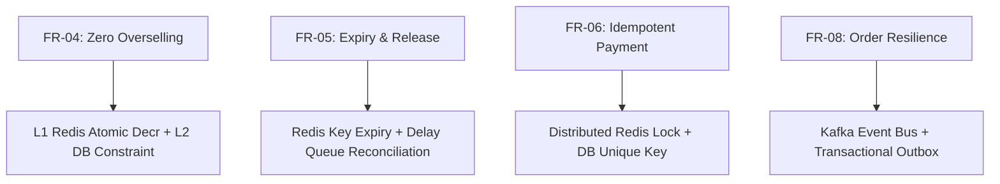

# Stage 1: Requirements & Assumptions Document

## Executive Summary
This document establishes the functional and non-functional requirements, traffic assumptions, system boundaries, and consistency guarantees for **SALESTORM** — a high-scale e-commerce flash-sale platform designed to process 10,000 concurrent purchase requests for 100 available units of a limited-stock product without overselling or data corruption.

---

## 1. Functional Requirements (FR)

| ID | Category | Requirement Description |
| :--- | :--- | :--- |
| **FR-01** | Product Discovery | Customers can view product details, real-time availability indicator, and promotional pricing. |
| **FR-02** | Cart Management | Customers can add items to cart and proceed to high-concurrency checkout. |
| **FR-03** | Concurrency-Safe Reservation | The system must atomically reserve inventory upon "Buy Now" request. Reservations are held for 10 minutes. |
| **FR-04** | Strict Anti-Overselling | For $N=100$ available items, under no circumstances shall more than $N$ reservations or orders be confirmed. |
| **FR-05** | Reservation Expiry & Auto-Release | Unpaid or timed-out reservations must auto-expire after 10 minutes, returning stock to `AVAILABLE`. |
| **FR-06** | Idempotent Payment | Duplicate payment submissions (with identical `idempotency_key`) must be detected and processed strictly once. |
| **FR-07** | Payment Failure Handling | Failed payments must immediately release reserved inventory back to `AVAILABLE` pool. |
| **FR-08** | Eventual Order Confirmation | Successful payments must asynchronously guarantee order creation (`CREATED` $\rightarrow$ `CONFIRMED` $\rightarrow$ `PROCESSING`), even if Order Service is temporarily down. |
| **FR-09** | Order Lifecycle Tracking | Customers and operations can track order states: `CREATED`, `PAYMENT_PENDING`, `CONFIRMED`, `PROCESSING`, `SHIPPED`, `OUT_FOR_DELIVERY`, `DELIVERED`, `CANCELLED`. |

---

## 2. Non-Functional Requirements (NFR)

| Dimension | Target Metric / Requirement | Hard Guarantee vs. Target |
| :--- | :--- | :--- |
| **Throughput (Peak)** | 10,000 req/sec baseline; scalable up to 500,000 req/sec flash burst | Target (Horizontal Scale) |
| **Latency (Reservation)** | $p99 < 50\text{ms}$ for Inventory Reservation API call | Target |
| **Latency (Checkout end-to-end)** | $p99 < 1500\text{ms}$ (including 3rd-party Payment Gateway) | Target |
| **Availability** | $99.99\%$ availability for Product Discovery and Checkout ingress | Target |
| **Consistency (Inventory)** | **Strict Serializability / Linearizability** for stock reservation | **STRICT GUARANTEE** |
| **Consistency (Order State)** | **Eventual Consistency** within $5\text{ seconds}$ post-payment | Target |
| **Idempotency** | $100\%$ protection against duplicate transaction processing | **STRICT GUARANTEE** |
| **Fault Tolerance** | Zero order loss during 30s Order Service outage; automatic recovery | **STRICT GUARANTEE** |

---

## 3. System Assumptions & Traffic Estimations

### 3.1 Load & Volume Profile
- **Flash Sale SKU:** 1 Product ($N = 100$ units).
- **Concurrent Spike:** 10,000 users hitting "Buy Now" within a 1-second window.
- **Normal Traffic:** 10,000 requests/sec across catalog.
- **Extreme Peak Scale-out Factor ($50\times$):** 500,000 requests/sec.
- **Payment Success Rate:** $95\%$
- **Payment Failure Rate:** $5\%$
- **Network Retries / Duplicates:** $2\%$ duplicate payload submission rate.
- **Service Failure Simulation:** Order Service experiencing a 30-second outage.

### 3.2 System Constraints
1. **Third-Party Payment Gateway Latency:** 200ms – 1200ms (uncontrollable external dependency).
2. **Database Write Bottleneck:** Standard single RDBMS row update max throughput is $\approx 500 - 1000\text{ TPS}$. Direct DB updates for 10k requests will fail without caching/queuing layer.
3. **Network Partition Tolerance:** CP (CAP Theorem) for Inventory Reservation; AP for Order Fulfillment and Notifications.

---

## 4. Requirements Traceability Matrix

