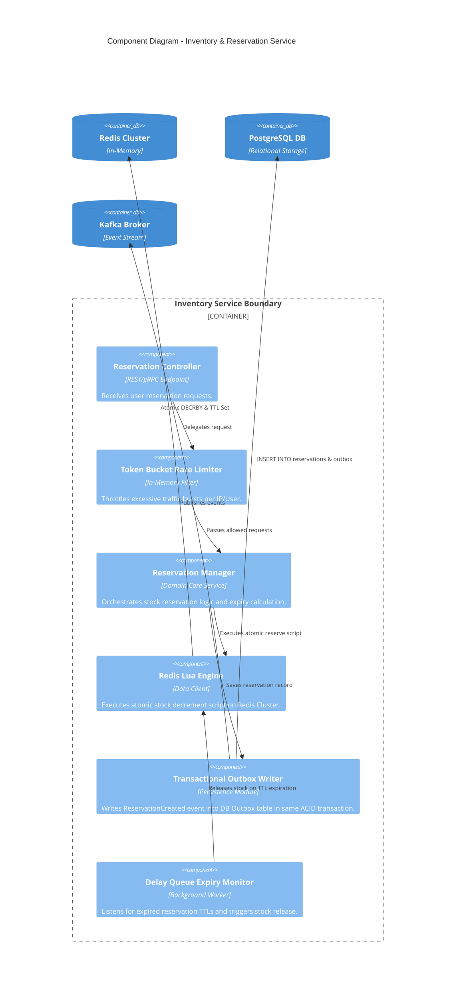
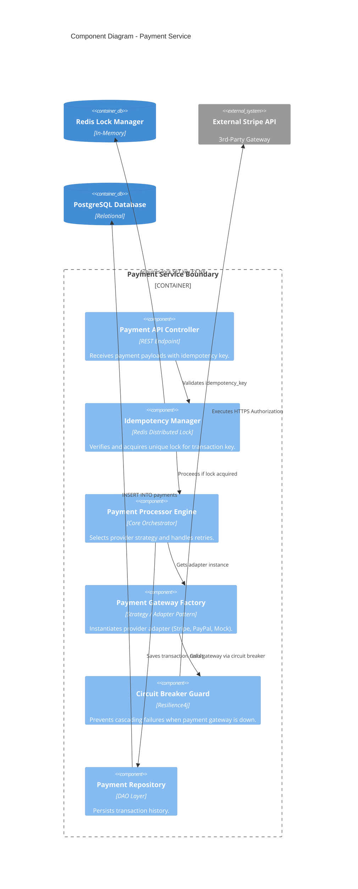

# Stage 2: Component Diagram (C4 Level 3 - Critical Services)

## 1. Inventory Service Internal Component Diagram

```mermaid
C4Component
    title Component Diagram - Inventory & Reservation Service

    Container_Boundary(inv_boundary, "Inventory Service Boundary") {
        Component(inv_controller, "Reservation Controller", "REST/gRPC Endpoint", "Receives user reservation requests.")
        Component(rate_limiter, "Token Bucket Rate Limiter", "In-Memory Filter", "Throttles excessive traffic bursts per IP/User.")
        Component(res_manager, "Reservation Manager", "Domain Core Service", "Orchestrates stock reservation logic and expiry calculation.")
        Component(lua_executor, "Redis Lua Engine", "Data Client", "Executes atomic stock decrement script on Redis Cluster.")
        Component(outbox_writer, "Transactional Outbox Writer", "Persistence Module", "Writes ReservationCreated event into DB Outbox table in same ACID transaction.")
        Component(expiry_scheduler, "Delay Queue Expiry Monitor", "Background Worker", "Listens for expired reservation TTLs and triggers stock release.")
    }

    ContainerDb(redis, "Redis Cluster", "In-Memory")
    ContainerDb(pg, "PostgreSQL DB", "Relational Storage")
    ContainerDb(kafka, "Kafka Broker", "Event Stream")

    Rel(inv_controller, rate_limiter, "Delegates request")
    Rel(rate_limiter, res_manager, "Passes allowed requests")
    Rel(res_manager, lua_executor, "Executes atomic reserve script")
    Rel(lua_executor, redis, "Atomic DECRBY & TTL Set")
    Rel(res_manager, outbox_writer, "Saves reservation record")
    Rel(outbox_writer, pg, "INSERT INTO reservations & outbox")
    Rel(expiry_scheduler, lua_executor, "Releases stock on TTL expiration")
    Rel(outbox_writer, kafka, "Publishes events")
```

---

## 2. Payment Service Component Diagram

```mermaid
C4Component
    title Component Diagram - Payment Service

    Container_Boundary(pay_boundary, "Payment Service Boundary") {
        Component(pay_controller, "Payment API Controller", "REST Endpoint", "Receives payment payloads with idempotency key.")
        Component(idempotency_guard, "Idempotency Manager", "Redis Distributed Lock", "Verifies and acquires unique lock for transaction key.")
        Component(pay_processor, "Payment Processor Engine", "Core Orchestrator", "Selects provider strategy and handles retries.")
        Component(gw_factory, "Payment Gateway Factory", "Strategy / Adapter Pattern", "Instantiates provider adapter (Stripe, PayPal, Mock).")
        Component(cb_guard, "Circuit Breaker Guard", "Resilience4j", "Prevents cascading failures when payment gateway is down.")
        Component(pay_repo, "Payment Repository", "DAO Layer", "Persists transaction history.")
    }

    ContainerDb(redis, "Redis Lock Manager", "In-Memory")
    System_Ext(stripe, "External Stripe API", "3rd-Party Gateway")
    ContainerDb(pg, "PostgreSQL Database", "Relational")

    Rel(pay_controller, idempotency_guard, "Validates idempotency_key")
    Rel(idempotency_guard, redis, "Acquires lock SET key EX NX")
    Rel(idempotency_guard, pay_processor, "Proceeds if lock acquired")
    Rel(pay_processor, gw_factory, "Gets adapter instance")
    Rel(gw_factory, cb_guard, "Calls gateway via circuit breaker")
    Rel(cb_guard, stripe, "Executes HTTPS Authorization")
    Rel(pay_processor, pay_repo, "Saves transaction result")
    Rel(pay_repo, pg, "INSERT INTO payments")
```
