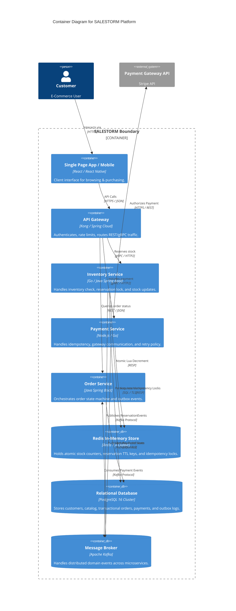

# Stage 2: Container Diagram (C4 Level 2)

## 1. Container Architecture Overview

---

## 2. Service Responsibilities & Protocols
- **API Gateway:** Protocol translation (HTTPS REST $\rightarrow$ internal gRPC for ultra-low latency).
- **Inventory Service:** High-performance Go microservice managing Redis Lua scripts and DB sync workers.
- **Payment Service:** Resilient microservice executing Strategy Pattern for Payment Gateways and Circuit Breaker logic.
- **Order Service:** State machine manager handling transactional updates and background reconciliation.
