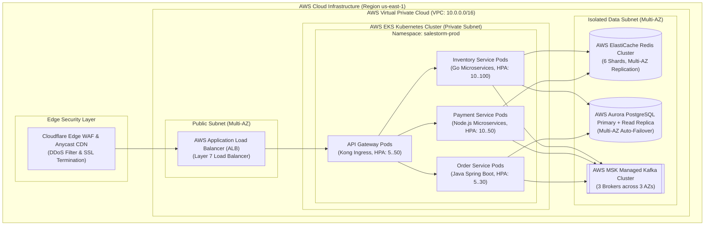

# Stage 2: Deployment Diagram (Kubernetes Multi-AZ Production Cloud)

## 1. Cloud Infrastructure & Deployment Topology

---

## 2. Infrastructure Scaling & High-Availability Policies
- **Kubernetes Horizontal Pod Autoscaler (HPA):**
  - **Inventory Service:** Scales based on CPU ($>60\%$) and custom metric `http_requests_per_second`. Pre-scaled to 50 pods 15 minutes before flash sale launch!
- **Data Subnet Isolation:**
  - Database and Cache instances operate inside private subnets accessible only via Security Group rules from the EKS worker node security group.
- **Redundancy & Failover:**
  - Multi-AZ deployment across 3 availability zones (`us-east-1a`, `us-east-1b`, `us-east-1c`).
  - Redis Primary-Replica with automatic failover (< 10 seconds).
  - PostgreSQL Aurora Multi-AZ with zero-data-loss failover (< 15 seconds).
