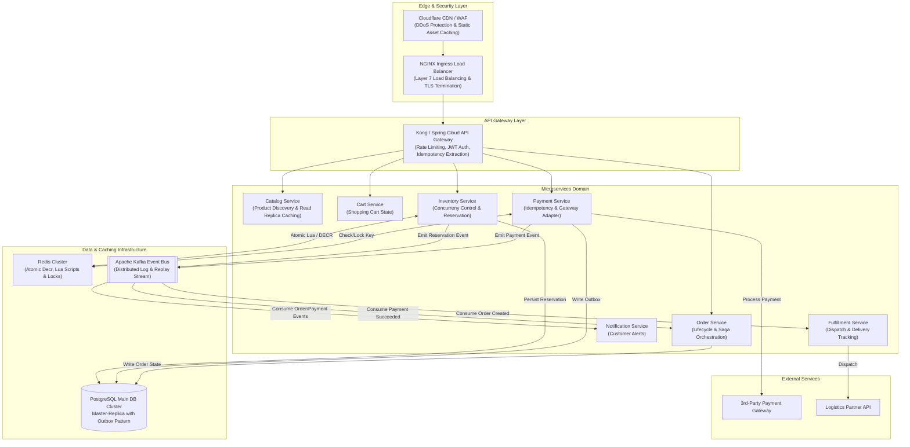

# High-Level Architecture (HLD) & System Boundaries

## 1. Complete High-Level Architecture Diagram



---

## 2. Component Responsibility & Justification

| Component | Responsibility | Why it Exists & Trade-off |
| :--- | :--- | :--- |
| **Cloudflare CDN / WAF** | Absorbs invalid bot traffic, static image assets, and DDoS attempts. | **Why:** Protects internal load balancers from traffic saturation.<br>**Trade-off:** Adds minor latency for uncached dynamic requests. |
| **API Gateway** | Single entry point for routing, authentication, rate limiting, and extracting `X-Idempotency-Key`. | **Why:** Centralizes cross-cutting concerns.<br>**Trade-off:** Potential single point of failure if not scaled horizontally. |
| **Redis Cluster (L1 Stock)** | Manages atomic in-memory stock decrementing and reservation TTLs via Lua scripts. | **Why:** Can execute 100,000+ ops/sec per shard in sub-millisecond time. Protects relational DB from 10k concurrent lock requests.<br>**Trade-off:** Memory volatility requiring DB Write-Ahead persistence. |
| **PostgreSQL Main DB** | System of record for Orders, Payments, and Inventory snapshot durability. Uses ACID transactions and Outbox table. | **Why:** Ensures strict data durability, compliance, and relational queries.<br>**Trade-off:** Lower write throughput compared to in-memory caches. |
| **Apache Kafka Event Bus** | Asynchronous event backbone for decoupled communication (`ReservationCreated`, `PaymentSucceeded`, `OrderCreated`). | **Why:** Decouples Order Service from Payment Service. If Order Service is down for 30s, Kafka buffers events without data loss.<br>**Trade-off:** Eventual consistency complexity. |

---

## 3. Communication Patterns

```mermaid
matrix
    title Communication Pattern Matrix
```

- **Synchronous (REST/gRPC):**
  - Gateway $\rightarrow$ Inventory Service (User waiting for immediate reservation confirmation).
  - Payment Service $\rightarrow$ External Payment Gateway (Real-time card authorization).
- **Asynchronous (Event-Driven via Kafka):**
  - Payment Service $\rightarrow$ Order Service (Order creation after payment success).
  - Order Service $\rightarrow$ Fulfillment Service.
  - All Services $\rightarrow$ Notification Service.
