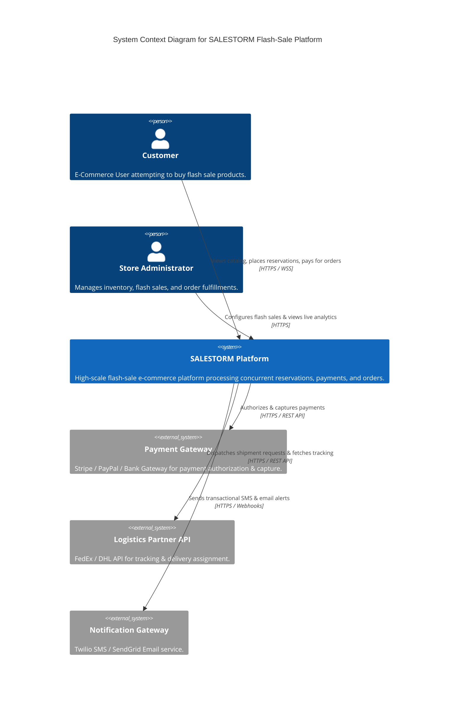

# Stage 2: System Context Diagram (C4 Level 1)

## 1. Context Overview
The **SALESTORM System Context** illustrates the external actors, clients, core platform boundaries, and third-party integrations (Payment Gateways, Logistics Providers, Notification Channels).

## 2. Context Interaction Rationale
- **Customer $\rightarrow$ SALESTORM:** Encrypted HTTPS requests routed through global Anycast CDN/WAF.
- **SALESTORM $\rightarrow$ Payment Gateway:** Outbound REST calls with Circuit Breaker protection.
- **SALESTORM $\rightarrow$ Logistics / Notifications:** Asynchronous event-driven integration to avoid blocking payment checkout flow.
