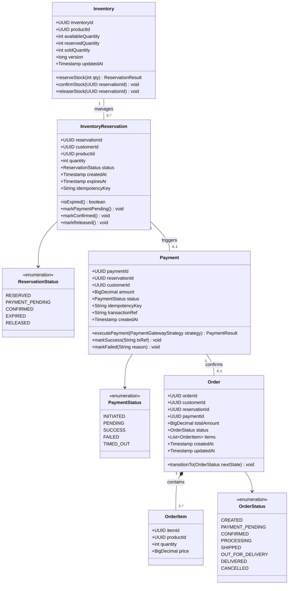
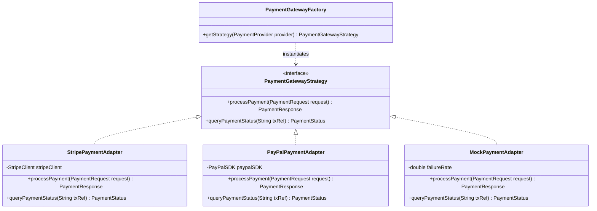
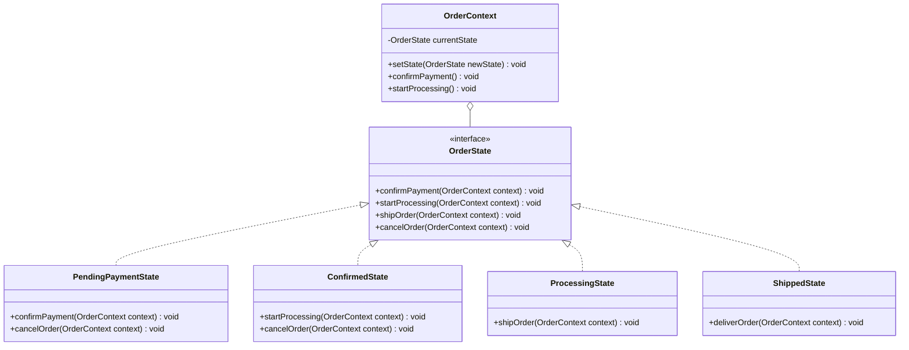

# Stage 5 & 6: Class Diagrams & Object-Oriented Domain Model

## 1. Core Domain Class Diagram (Inventory, Payment, Order Modules)

---

## 2. Design Pattern Class Hierarchy

### 2.1 Payment Gateway Adapter & Strategy Pattern

---

### 2.2 Order State Machine (State Pattern)

