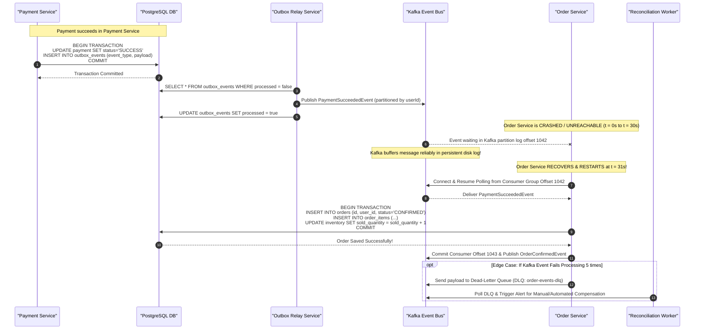

# Order Creation, Resilience & Recovery Sequence Diagram

## 1. Async Order Creation & Outage Recovery (30s Order Service Outage Handling)

This diagram details the transactional outbox pattern and Kafka buffering mechanism when the Order Service is temporarily unavailable for 30 seconds after payment success.

