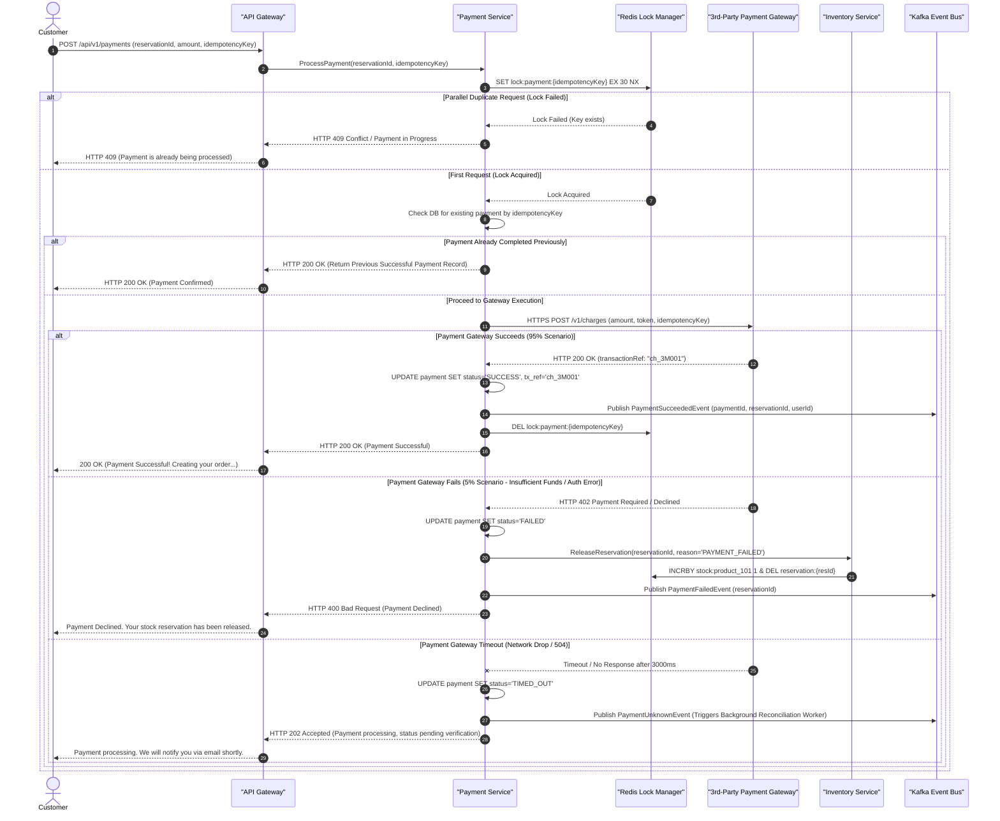

# Payment Sequence Diagram & Idempotency Workflows

## 1. Payment Success, Failure & Timeout Workflows

```mermaid
sequenceDiagram
    autonumber
    actor Customer
    participant GW as "API Gateway"
    participant PaySvc as "Payment Service"
    participant Redis as "Redis Lock Manager"
    participant Stripe as "3rd-Party Payment Gateway"
    participant InvSvc as "Inventory Service"
    participant Kafka as "Kafka Event Bus"

    Customer->>GW: POST /api/v1/payments (reservationId, amount, idempotencyKey)
    GW->>PaySvc: ProcessPayment(reservationId, idempotencyKey)

    PaySvc->>Redis: SET lock:payment:{idempotencyKey} EX 30 NX
    
    alt Parallel Duplicate Request (Lock Failed)
        Redis-->>PaySvc: Lock Failed (Key exists)
        PaySvc-->>GW: HTTP 409 Conflict / Payment in Progress
        GW-->>Customer: HTTP 409 (Payment is already being processed)
    else First Request (Lock Acquired)
        Redis-->>PaySvc: Lock Acquired
        PaySvc->>PaySvc: Check DB for existing payment by idempotencyKey
        
        alt Payment Already Completed Previously
            PaySvc-->>GW: HTTP 200 OK (Return Previous Successful Payment Record)
            GW-->>Customer: HTTP 200 OK (Payment Confirmed)
        else Proceed to Gateway Execution
            PaySvc->>Stripe: HTTPS POST /v1/charges (amount, token, idempotencyKey)
            
            alt Payment Gateway Succeeds (95% Scenario)
                Stripe-->>PaySvc: HTTP 200 OK (transactionRef: "ch_3M001")
                PaySvc->>PaySvc: UPDATE payment SET status='SUCCESS', tx_ref='ch_3M001'
                PaySvc->>Kafka: Publish PaymentSucceededEvent (paymentId, reservationId, userId)
                PaySvc->>Redis: DEL lock:payment:{idempotencyKey}
                PaySvc-->>GW: HTTP 200 OK (Payment Successful)
                GW-->>Customer: 200 OK (Payment Successful! Creating your order...)
                
            else Payment Gateway Fails (5% Scenario - Insufficient Funds / Auth Error)
                Stripe-->>PaySvc: HTTP 402 Payment Required / Declined
                PaySvc->>PaySvc: UPDATE payment SET status='FAILED'
                PaySvc->>InvSvc: ReleaseReservation(reservationId, reason='PAYMENT_FAILED')
                InvSvc->>Redis: INCRBY stock:product_101 1 & DEL reservation:{resId}
                PaySvc->>Kafka: Publish PaymentFailedEvent (reservationId)
                PaySvc-->>GW: HTTP 400 Bad Request (Payment Declined)
                GW-->>Customer: Payment Declined. Your stock reservation has been released.
                
            else Payment Gateway Timeout (Network Drop / 504)
                Stripe--xPaySvc: Timeout / No Response after 3000ms
                PaySvc->>PaySvc: UPDATE payment SET status='TIMED_OUT'
                PaySvc->>Kafka: Publish PaymentUnknownEvent (Triggers Background Reconciliation Worker)
                PaySvc-->>GW: HTTP 202 Accepted (Payment processing, status pending verification)
                GW-->>Customer: Payment processing. We will notify you via email shortly.
            end
        end
    end
```
