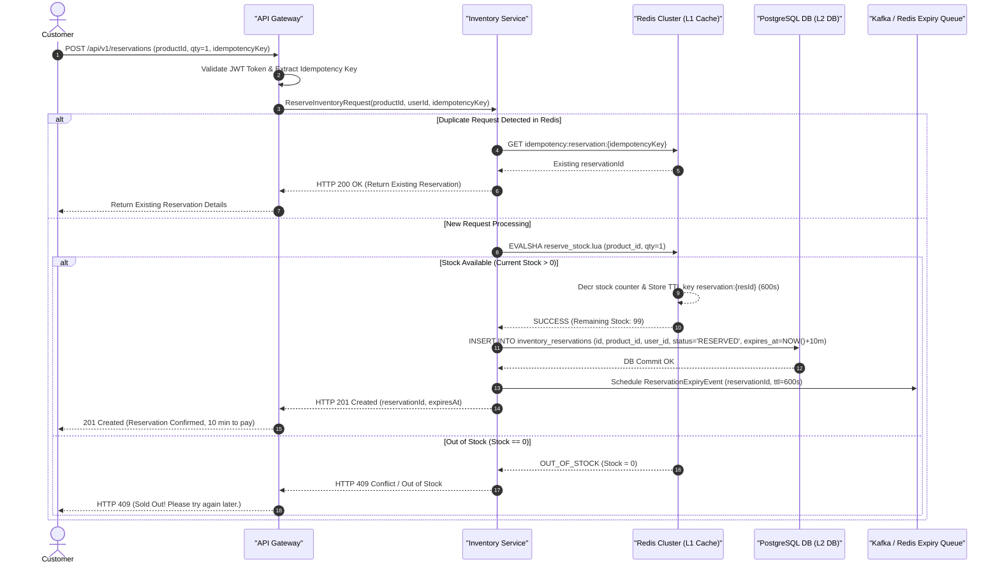

# Purchase & Inventory Reservation Sequence Diagram

## 1. High-Concurrency Purchase & Reservation Workflow

This sequence traces what happens when a customer clicks **"Buy Now"** during the flash sale, demonstrating L1 Redis Lua execution, protection against overselling, and creation of a 10-minute inventory reservation.



---

## 2. Low-Level Lua Script Logic (Executing inside Redis)
```lua
-- KEYS[1]: product_stock_key (e.g. "stock:product_101")
-- KEYS[2]: reservation_key (e.g. "reservation:uuid_xyz")
-- ARGV[1]: requested_quantity (e.g. 1)
-- ARGV[2]: ttl_seconds (e.g. 600)

local current_stock = tonumber(redis.call('GET', KEYS[1]) or '0')
local req_qty = tonumber(ARGV[1])

if current_stock >= req_qty then
    redis.call('DECRBY', KEYS[1], req_qty)
    redis.call('SETEX', KEYS[2], tonumber(ARGV[2]), "RESERVED")
    return {1, current_stock - req_qty} -- Success code 1
else
    return {0, current_stock} -- Failure code 0 (Out of Stock)
end
```
