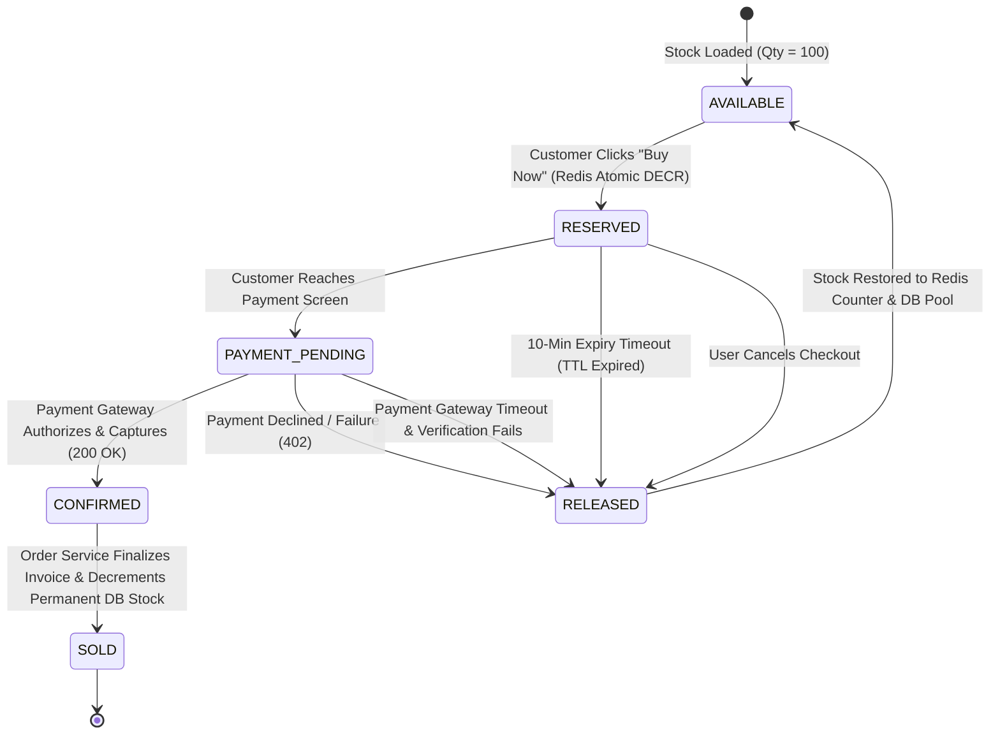
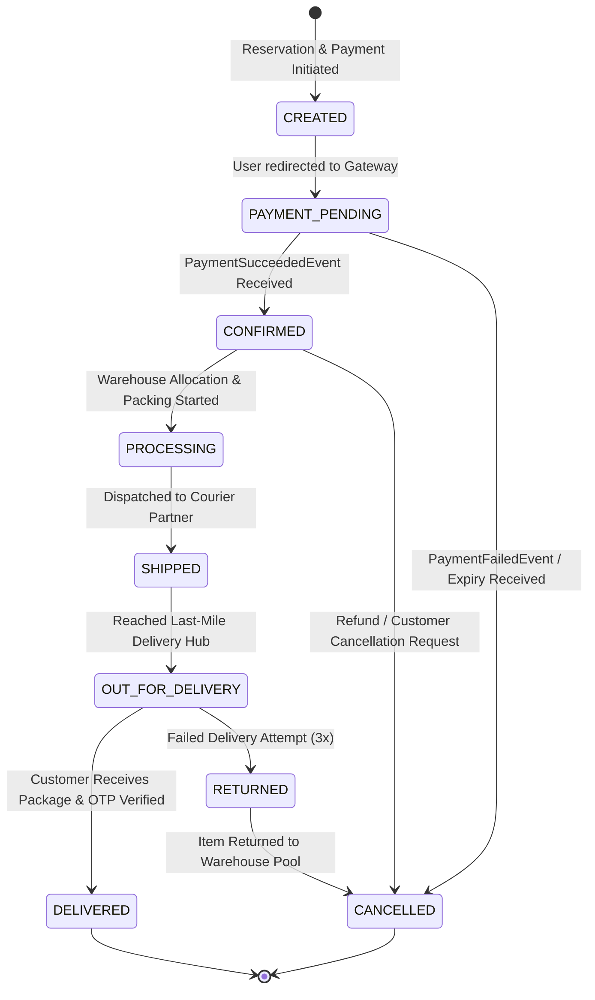

# Order & Inventory Reservation Lifecycle State Diagrams

## 1. Inventory Stock & Reservation State Machine

```mermaid
stateDiagram-v2
    [*] --> AVAILABLE : Stock Loaded (Qty = 100)
    
    AVAILABLE --> RESERVED : Customer Clicks "Buy Now" (Redis Atomic DECR)
    
    RESERVED --> PAYMENT_PENDING : Customer Reaches Payment Screen
    RESERVED --> RELEASED : 10-Min Expiry Timeout (TTL Expired)
    RESERVED --> RELEASED : User Cancels Checkout
    
    PAYMENT_PENDING --> CONFIRMED : Payment Gateway Authorizes & Captures (200 OK)
    PAYMENT_PENDING --> RELEASED : Payment Declined / Failure (402)
    PAYMENT_PENDING --> RELEASED : Payment Gateway Timeout & Verification Fails
    
    CONFIRMED --> SOLD : Order Service Finalizes Invoice & Decrements Permanent DB Stock
    
    RELEASED --> AVAILABLE : Stock Restored to Redis Counter & DB Pool
    
    SOLD --> [*]
```

---

## 2. Comprehensive Order Lifecycle State Machine

```mermaid
stateDiagram-v2
    [*] --> CREATED : Reservation & Payment Initiated
    
    CREATED --> PAYMENT_PENDING : User redirected to Gateway
    
    PAYMENT_PENDING --> CONFIRMED : PaymentSucceededEvent Received
    PAYMENT_PENDING --> CANCELLED : PaymentFailedEvent / Expiry Received
    
    CONFIRMED --> PROCESSING : Warehouse Allocation & Packing Started
    CONFIRMED --> CANCELLED : Refund / Customer Cancellation Request
    
    PROCESSING --> SHIPPED : Dispatched to Courier Partner
    
    SHIPPED --> OUT_FOR_DELIVERY : Reached Last-Mile Delivery Hub
    
    OUT_FOR_DELIVERY --> DELIVERED : Customer Receives Package & OTP Verified
    OUT_FOR_DELIVERY --> RETURNED : Failed Delivery Attempt (3x)
    
    RETURNED --> CANCELLED : Item Returned to Warehouse Pool
    
    DELIVERED --> [*]
    CANCELLED --> [*]
```
