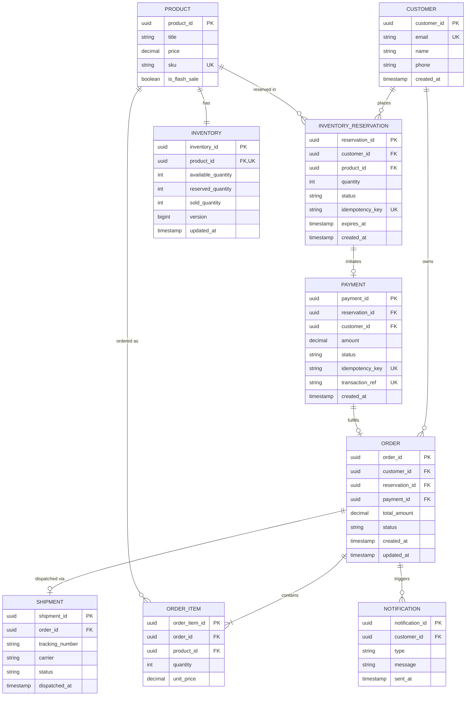

# Stage 3 & 4: Database ER Diagram & Concurrency Schema Design

## 1. Entity Relationship Diagram (ERD)



---

## 2. DDL SQL Schema (PostgreSQL with Concurrency & Index Optimization)

```sql
-- 1. Inventory Table with Concurrency Versioning and Non-Negative Constraint
CREATE TABLE inventory (
    inventory_id UUID PRIMARY KEY DEFAULT gen_random_uuid(),
    product_id UUID NOT NULL UNIQUE REFERENCES product(product_id),
    available_quantity INT NOT NULL CHECK (available_quantity >= 0),
    reserved_quantity INT NOT NULL DEFAULT 0 CHECK (reserved_quantity >= 0),
    sold_quantity INT NOT NULL DEFAULT 0 CHECK (sold_quantity >= 0),
    version BIGINT NOT NULL DEFAULT 0,
    updated_at TIMESTAMP WITH TIME ZONE DEFAULT CURRENT_TIMESTAMP
);

-- Index for instant lookup during flash sale
CREATE INDEX idx_inventory_product ON inventory(product_id);

-- 2. Inventory Reservation Table with Idempotency & Expiry Indexing
CREATE TABLE inventory_reservation (
    reservation_id UUID PRIMARY KEY DEFAULT gen_random_uuid(),
    customer_id UUID NOT NULL REFERENCES customer(customer_id),
    product_id UUID NOT NULL REFERENCES product(product_id),
    quantity INT NOT NULL DEFAULT 1 CHECK (quantity > 0),
    status VARCHAR(30) NOT NULL DEFAULT 'RESERVED', -- RESERVED, PAYMENT_PENDING, CONFIRMED, RELEASED
    idempotency_key VARCHAR(128) NOT NULL UNIQUE,
    expires_at TIMESTAMP WITH TIME ZONE NOT NULL,
    created_at TIMESTAMP WITH TIME ZONE DEFAULT CURRENT_TIMESTAMP
);

-- Index for background reconciliation of expired reservations
CREATE INDEX idx_reservation_expiry ON inventory_reservation(status, expires_at) 
WHERE status = 'RESERVED';

-- 3. Payment Table with Idempotency Key & Provider Transaction Reference
CREATE TABLE payment (
    payment_id UUID PRIMARY KEY DEFAULT gen_random_uuid(),
    reservation_id UUID NOT NULL REFERENCES inventory_reservation(reservation_id),
    customer_id UUID NOT NULL REFERENCES customer(customer_id),
    amount DECIMAL(12,2) NOT NULL,
    status VARCHAR(30) NOT NULL, -- INITIATED, SUCCESS, FAILED, TIMED_OUT
    idempotency_key VARCHAR(128) NOT NULL UNIQUE,
    transaction_ref VARCHAR(128) UNIQUE,
    created_at TIMESTAMP WITH TIME ZONE DEFAULT CURRENT_TIMESTAMP
);

CREATE INDEX idx_payment_idempotency ON payment(idempotency_key);

-- 4. Transactional Outbox Table for Async Event Reliability
CREATE TABLE outbox_event (
    event_id UUID PRIMARY KEY DEFAULT gen_random_uuid(),
    aggregate_type VARCHAR(50) NOT NULL,
    aggregate_id UUID NOT NULL,
    event_type VARCHAR(50) NOT NULL,
    payload JSONB NOT NULL,
    processed BOOLEAN NOT NULL DEFAULT FALSE,
    created_at TIMESTAMP WITH TIME ZONE DEFAULT CURRENT_TIMESTAMP
);

CREATE INDEX idx_outbox_unprocessed ON outbox_event(created_at) WHERE processed = FALSE;
```
