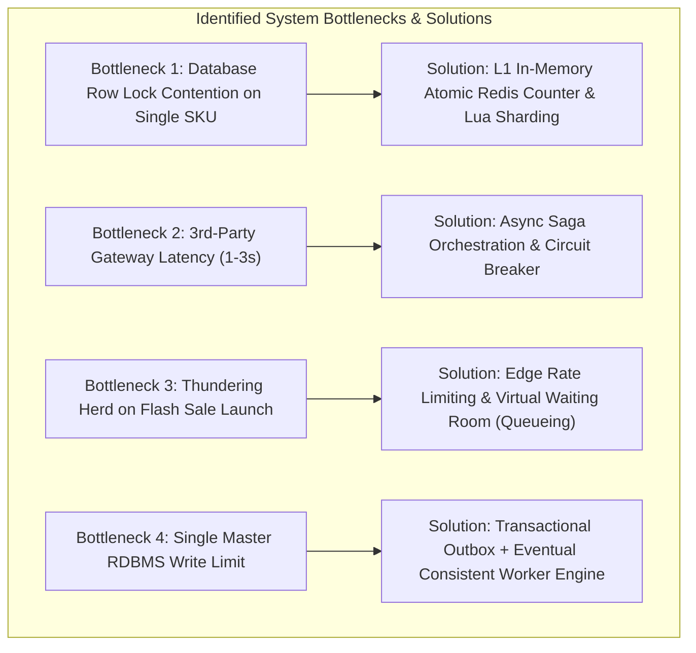

# Stage 8: Scalability, Concurrency Bottlenecks & Reliability Design

## 1. Scalability Architecture & Bottleneck Analysis

### 1.1 Traffic Burst Scaling Strategy ($10,000 \rightarrow 500,000\text{ RPS}$)
- **Edge Layer Rate Limiting:** Cloudflare / Kong Gateway configured with Token Bucket algorithm ($500\text{ req/sec}$ per IP).
- **Virtual Waiting Room (Queueing):** When incoming requests exceed system capacity, requests are queued in Redis Sorted Sets (`ZADD flash_queue <timestamp> <user_id>`) and issued a queue token.
- **Pre-Warmed Infrastructure:** Redis nodes and Kubernetes Pods pre-scaled to 50 pods 15 minutes before scheduled sale start time (`t-15m`).

---

## 2. Concurrency-Control Comparison & Justification

| Approach | Implementation Mechanics | Throughput @ 10k Concurrency | Latency | Verdict & Selection Rationale |
| :--- | :--- | :--- | :--- | :--- |
| **Pessimistic Locking (`SELECT FOR UPDATE`)** | DB locks row until transaction completes. | $\approx 500\text{ TPS}$ | High ($>500\text{ms}$) | **REJECTED:** Causes deadlocks and database connection starvation under flash-sale bursts. |
| **Optimistic Locking (`version` column)** | `UPDATE stock SET qty=qty-1, version=version+1 WHERE version=@v` | $\approx 1,200\text{ TPS}$ | Medium ($>200\text{ms}$) | **REJECTED:** 99% of retries fail due to version mismatch ("thundering herd" CPU burn). |
| **Redis Atomic Lua Script (SELECTED)** | Single-threaded in-memory atomic decrement `DECRBY`. | **$> 100,000\text{ TPS}$** | **Ultra-Low ($< 5\text{ms}$)** | **SELECTED FOR PRODUCTION:** Guarantees 0ms DB lock wait; exact 100 reservations granted instantly. |

---

## 3. Reliability & Failure Recovery Matrix

| Failure Mode | Impact | Automated System Recovery Response |
| :--- | :--- | :--- |
| **30-Second Order Service Outage** | Order creation API calls fail. | Payment Service writes to Kafka. Kafka buffers events for 30s. When Order Service recovers, it resumes consuming log offsets with zero data loss. |
| **Payment Gateway Timeout (504)** | Gateway response lost in transit. | Circuit Breaker trips. Transaction status set to `TIMED_OUT`. Background Reconciliation Worker queries gateway status via `transaction_ref` to confirm/cancel. |
| **Payment Failure (Declined Card)** | Reservation held for 10m unpaid. | Payment Service publishes `PaymentFailedEvent`. Inventory Service immediately releases stock (`INCRBY stock 1`) to `AVAILABLE` pool without waiting for 10m TTL! |
| **Database Primary Failover** | Master DB goes down. | AWS Aurora auto-promotes Read Replica to Primary (<15s). API Gateway retries failed SQL queries via Exponential Backoff with Jitter. |
