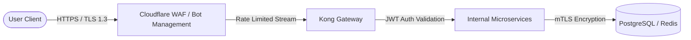
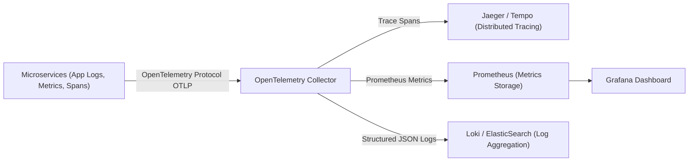

# Stage 9: Security, Observability & Distributed Tracing Design

## 1. Security Architecture & Threat Protection

### Key Security Implementations:
- **Authentication & Authorization:** OAuth 2.0 / OIDC JWT Tokens with RS256 signature verification at API Gateway.
- **Idempotency Protection:** Enforced header `X-Idempotency-Key`. Double-submit requests rejected at Redis layer before hitting business logic.
- **PCI-DSS Compliance:** Zero credit card raw data enters internal databases; Stripe Elements tokenization (`tok_123`) used exclusively.
- **Bot Mitigation:** Cloudflare Turnstile / CAPTCHA challenge triggered on suspicious IP spikes during flash sale opening.

---

## 2. Observability & Distributed Tracing Architecture

### 2.1 Core Telemetry Metrics & Alerting Thresholds

| Metric Name | Type | Description | Alert Trigger Condition |
| :--- | :--- | :--- | :--- |
| `salestorm_inventory_stock_level` | Gauge | Real-time available stock count in Redis | Alert if stock $< 0$ (CRITICAL) |
| `salestorm_reservation_latency_ms` | Histogram | Latency distribution of stock reservation | Alert if $p99 > 100\text{ms}$ for 1 min |
| `salestorm_payment_failure_rate` | Counter | Percentage of failed payment gateway calls | Alert if failure rate $> 15\%$ |
| `salestorm_kafka_consumer_lag` | Gauge | Unconsumed messages in `payment-events` topic | Alert if lag $> 1,000$ messages |
| `salestorm_duplicate_requests_total` | Counter | Total duplicate `X-Idempotency-Key` hits | Monitor for attack spikes |

### 2.2 Trace Context Propagation Example
Every request receives a trace context header: `traceparent: 00-4bf92f3577b34da6a3ce929d0e0e4736-00f067aa0ba902b7-01`.
Traces track request transit across:
`Gateway` $\rightarrow$ `Inventory Service` $\rightarrow$ `Redis` $\rightarrow$ `Payment Service` $\rightarrow$ `Stripe API` $\rightarrow$ `Kafka` $\rightarrow$ `Order Service`.
