# Final 5-Minute Technical Defense Pitch Script

## Pitch Structure & Time Breakdown

```mermaid
gantt
    title 5-Minute Technical Defense Schedule (300 Seconds Total)
    dateFormat  ss
    axisFormat  %S sec

    section Problem & Requirements
    Industry Need & Challenge   : 00, 30s
    Requirements & Constraints  : 30, 30s

    section Core Architecture
    HLD & Service Boundaries    : 60, 60s
    Concurrency & Inventory     : 120, 60s

    section Workflows & LLD
    Payment & Order Workflows   : 180, 45s
    LLD, SOLID & Design Patterns: 225, 45s

    section Evaluation
    Scalability & AI Evidence   : 270, 30s
```

---

## Pitch Script Transcripts by Speaker

### 00:00 - 00:30 (30 sec) | Problem Statement & Industry Challenge
> **Speaker 1 (System Architect):**
> "Good morning, respected judges. In high-demand e-commerce flash sales, platforms face a catastrophic paradox: thousands of concurrent requests attempt to purchase limited stock simultaneously. If your architecture relies on traditional relational database row locks, your system will deadlock, crash, or worse—oversell limited inventory. SALESTORM solves this challenge through a multi-tier, zero-overselling architecture capable of processing 10,000 concurrent requests against just 100 units with 100% data consistency."

### 00:30 - 01:00 (30 sec) | Functional & Non-Functional Requirements
> **Speaker 1:**
> "Our core requirements mandate strict zero overselling, 10-minute temporary inventory reservations, idempotent payment execution protecting against 2% duplicate network payloads, and 100% order recovery during downstream outages—all while keeping reservation latency under 50 milliseconds."

### 01:00 - 02:00 (60 sec) | High-Level Architecture (HLD)
> **Speaker 2 (HLD & Infrastructure Engineer):**
> "Here is our High-Level Architecture. Traffic enters via Cloudflare WAF for DDoS protection and NGINX for TLS termination. Kong API Gateway validates JWTs and extracts `X-Idempotency-Key` headers. The core innovation is our **Two-Tier Concurrency Controller**: L1 uses a Redis Cluster executing single-threaded atomic Lua scripts for sub-5ms stock reservation, while L2 uses PostgreSQL with the Transactional Outbox pattern. Microservices communicate asynchronously via Apache Kafka."

### 02:00 - 03:00 (60 sec) | Critical Concurrency & 10,000 vs 100 Scenario
> **Speaker 2:**
> "When 10,000 customers hit 'Buy Now' simultaneously:
> 1. Requests bypass SQL databases entirely; Redis Lua script atomically decrements the stock counter `DECRBY`.
> 2. Exactly 100 requests receive successful reservations; the remaining 9,900 requests are rejected instantly at the edge with HTTP 409 Out of Stock.
> 3. Zero database lock contention, zero connection pool starvation, zero overselling."

### 03:00 - 03:45 (45 sec) | Payment & Order Reliability (30s Outage Scenario)
> **Speaker 3 (Data & Reliability Engineer):**
> "For payments, we enforce Redis distributed locks (`SET lock:payment:{idempotencyKey} EX 30 NX`). If payment succeeds, Payment Service emits a `PaymentSucceededEvent` into Kafka. If our Order Service suffers a 30-second crash, Kafka buffers events reliably in disk logs. Upon recovery, Order Service catches up seamlessly with zero order loss."

### 03:45 - 04:30 (45 sec) | LLD, SOLID & Design Patterns
> **Speaker 3:**
> "We mapped SOLID principles directly: Strategy Pattern decouples payment gateways (Stripe, PayPal), State Pattern governs order state transitions, and Factory Pattern instantiates payment adapters dynamically. Transactional Outbox eliminates the dual-write problem."

### 04:30 - 05:00 (30 sec) | AI-Assisted Validation & Conclusion
> **Speaker 1:**
> "We validated our design using an async simulation harness. Across 10,000 concurrent requests, exactly 100 reservations were granted, 200 duplicate requests blocked, 5 failed payments automatically released stock back to the pool, and all 95 confirmed orders survived a simulated Order Service crash. SALESTORM is production-ready, defensible, and scalable. Thank you, we welcome your questions!"
